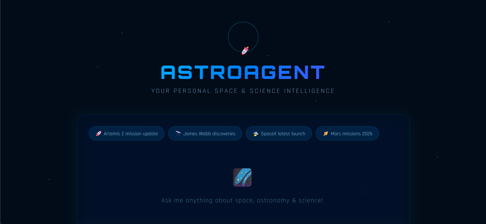

# AstroAgent — Personal Space & Science AI Agent
## Preview


An agentic AI application that fetches the latest space, astronomy, and science news, stores them in the **Endee Vector Database**, and lets you ask questions in natural language through a beautiful web interface.

---

## Problem Statement

There is no personalized, intelligent agent dedicated to space and science news. General news apps are cluttered and don't understand context. AstroAgent solves this by combining vector search with LLM reasoning to give accurate, context-aware answers about space and science.

---

## How It Works
```
User asks a question
        ↓
Query converted to vector (Sentence Transformers)
        ↓
Semantic Search in Endee Vector Database
        ↓
Top 5 relevant articles retrieved
        ↓
Groq LLM generates intelligent answer
        ↓
Answer displayed in Space-themed Web UI
```

---

## Tech Stack

| Component | Technology |
|---|---|
| Vector Database | Endee |
| Embeddings | Sentence Transformers (all-MiniLM-L6-v2) |
| LLM | Groq (llama-3.3-70b-versatile) |
| News Source | Spaceflight News API (free) |
| Backend | Flask (Python) |
| Frontend | HTML, CSS, JavaScript |

---

## How Endee is Used

- An index called `space_news` is created in Endee with 384 dimensions
- Each news article is converted to a 384-dimensional vector using Sentence Transformers
- Vectors are stored in Endee along with metadata (title, summary, URL)
- When a user asks a question, it is converted to a vector and a semantic search is performed in Endee
- Top 5 most relevant articles are retrieved and passed to the LLM as context

---

## Features

- Fetches 50 latest space and science articles on startup
- Semantic search using Endee vector database
- Natural language Q&A powered by Groq LLM
- Beautiful space-themed web UI
- Fast responses with vector similarity search
- Auto-refreshes news on every restart

---

## Setup and Installation

### Prerequisites
- Python 3.8+
- Docker Desktop (for Endee server)

### Step 1: Clone the repository
```bash
git clone https://github.com/rajsaumyaa/endee.git
cd endee
```

### Step 2: Start Endee Vector Database
```bash
docker run -d -p 8080:8080 --name endee-server endeeio/endee-server:latest
```

### Step 3: Install dependencies
```bash
pip install -r requirements.txt
```

### Step 4: Create .env file
```
GROQ_API_KEY=your_groq_api_key_here
```

### Step 5: Run the app
```bash
python app.py
```

### Step 6: Open in browser
```
http://localhost:5000
```

---

## Project Structure
```
AstroAgent/
├── app.py              # Flask web server
├── ingest.py           # Fetch news & store in Endee
├── agent.py            # AI agent logic
├── templates/
│   └── index.html      # Space-themed web UI
├── requirements.txt    # Dependencies
├── .env                # API keys (not committed)
└── README.md           # Project documentation
```

---

## API Keys Required

| Key | Where to get |
|---|---|
| GROQ_API_KEY | https://console.groq.com |

---

## Example Questions

- "What is the latest update on Artemis 2?"
- "What has James Webb telescope discovered recently?"
- "Tell me about SpaceX latest launch"
- "What are China Mars mission plans?"
